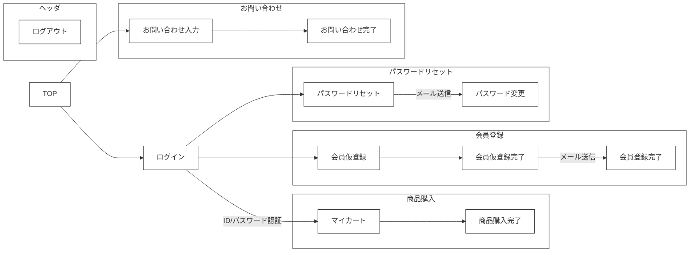

🌙 laravel-react-boilerplate
====

## 📗 プロジェクトの概要

Laravel ＆ React.js の学習用サンプルアプリケーションです。

### 対象としている方
- Laravelを初めて学習してみたい方
- Dockerを利用したLaravelの開発環境を構築したい方
- ECサイトを学習してみたい方
- 管理画面も作成（マルチログイン）を作成したい方
- Stripeを利用した決算処理を作成してみたい方
- ソーシャルログインを作成してみたい方
- オブジェクトストレージへの画像アップロードを作成してみたい方
- フロントエンドをReact.jsで作成してみたい方

### 利用している技術

#### ■ インフラ
- Apache 2.4.46　・・・　WebサーバーとしてApacheを採用しました。自己証明書を設定済みなので開発環境でSSLとして動作可能です。
- MySQL 8　・・・　DBサーバーにはMySQLを採用しました。データファイルや設定ファイル、 ログなどはコンテナの外に出して 開発時に参照出来るようにしています。
- phpMyAdmin　・・・　起動したMySQLのデータを参照・編集するためのツールです。
- MailHog 　・・・　ダミーのSMTPサーバーです。送信したメールをブラウザで閲覧することが可能です。実際にはメールは送信されないので開発時の誤送信してしまう心配がありません。
- Minio 　・・・　S3に完全互換性のあるオブジェクトストレージです。アップロードした画像の保存先として利用しています。
- Redis 　・・・　永続化可能なインメモリデータベースです。DBから取得したデータのキャッシュとして利用しています。

#### ■ アプリケーション

- Laravel 9
- React 18
- Typescript
- Bootstrap 4
- Adminlte 3

## 🌐 Demo

#### ■ フロント画面（React）

https://laraec.isystk.com/


- ログイン/ログアウト
- 会員登録
- パスワードリマインダ
- 商品一覧
- カートに追加
- 決算処理（Stripe）
- お気に入り追加
- お問い合わせ
- ソーシャルログイン（Google）



#### ■ 管理画面（Bootstrap）

https://laraec.isystk.com/admin/


- ログイン/ログアウト
- 商品管理
- 注文履歴
- 顧客管理
- お問い合わせ管理
- 画像管理
- CSVダウンロード
- PDFダウンロード
- 画像アップロード

#### ■ バッチ処理

- 商品CSV出力バッチ
- S3商品画像アップロードバッチ

## 🔧 開発環境の構築

※ この環境を利用する為には、事前にdocker、docker-composeが動作する状態であることが前提条件です。
(Windowsの場合は、以下を参考に「WSL」と「Docker Desktop for Windows」を用意してください)

### WSLのインストール（Windowsの場合）
参考
https://docs.microsoft.com/ja-jp/windows/wsl/install

WSLでUbuntuを起動する
```
# 初回起動時に、ユーザ名とパスワードが聞かれます。
# 何も入力せずにEnterを押すとroot ユーザーで利用できるようになるので、rootユーザーとして設定します。

# 初めにライブラリを最新化します。
$ apt update

# 日本語に対応しておきます。
$ apt -y install language-pack-ja
$ update-locale LANG=ja_JP.UTF8
$ apt -y install manpages-ja manpages-ja-dev
```

### Docker Desktop for Windows のインストール（Windowsの場合）

https://docs.docker.com/docker-for-windows/install/
```
↓コマンドプロンプトでバージョンが表示されればOK
docker --version
```

### WSL2から、Docker for Windows を利用できるようにする（Windowsの場合）
参考
https://qiita.com/endo_hizumi/items/0cc50bdfbd827579733e
```
１．通知領域から、dockerのアイコンを右クリックして、Settingを選択
２．Generalのexpose deamon on~~のチェックを入れます。
３．ResourcesのWSL INTEGRATION から、"Ubuntu" をスイッチをONにします。

WSL 側のルートを Docker for Windows に合わせるように WSL のマウント設定を行います。
$ vi /etc/wsl.conf
---
[automount]
root = /
options = "metadata"
---

以下のように Cドライブのパスが"/mnt/c/"→"/c/" に変更されていれば正常です。
$ cd /c/Users/USER/github/laravel-react-boilerplate
$ pwd
/c/Users/USER/github/laravel-react-boilerplate

# WSL 上にDockerとDocker Composeをインストールする。
$ apt install docker
$ apt install docker-compose

これでWSLからWindows側にインストールしたDockerが利用できるようになります。
```

### MySQL Client のインストール

```
# MySQLに接続する為のコマンドをインストールします。（バージョンは何でもOK）

# Windowsの場合
$ apt install mysql-client

# Macの場合
$ brew install mysql-client
```

### Node.js のインストール

```
# Windowsの場合
$ curl -L git.io/nodebrew | perl - setup
# Macの場合
$ brew install nodebrew

# nodebrew をシェルのパスに追加する
$ echo 'export PATH=$HOME/.nodebrew/current/bin:$PATH' >> ~/.bashrc

# Node.js をインストール 
$ mkdir -p ~/.nodebrew/src
$ nodebrew ls-remote
$ nodebrew install v16.13.1
$ nodebrew use v16.13.1
$ npm install -g yarn
```

## 📦 ディレクトリ構造

```
.
├── docker （各種Daemon）
│   │
│   ├── apache （Webサーバー）
│   │   ├── conf.d (apacheの設定ファイル)
│   │   └── logs （apacheのログ）
│   ├── mysql （DBサーバー）
│   │   ├── conf.d (mysqlの設定ファイル)
│   │   ├── data (mysqlのデータファイル)
│   │   ├── init （mysqlの初期DDL）
│   │   ├── logs （mysqlのログ）
│   │   └── script （mysql関連のスクリプト）
│   ├── php （PHP-FRM）
│   │   └── logs （phpのログ）
│   ├── phpmyadmin （DB管理ツール）
│   └── s3 （オブジェクトストレージ）
│
├── htdocs （Apache公開ディレクトリ）
│   │
│   ├── app
│   │   ├── Console (バッチアプリケーション)
│   │   ├── Exceptions (例外処理)
│   │   ├── Http （Webアプリケーション）
│   │   ├── Models（モデル）
│   │   ├── Prociders（サービスプロバイダー）
│   │   └── Services（共通処理）
│   ├── bootstrap
│   ├── config
│   ├── database
│   ├── public
│   ├── resources
│   ├── routes
│   ├── storage
│   ├── tests
│   └── composer.json
└── dc.sh （Dockerの起動用スクリプト）
```

## 🖊️ Docker 操作用シェルスクリプトの使い方

```
Usage:
  dc.sh [command] [<options>]

Options:
  stats|st                 Dockerコンテナの状態を表示します。
  init                     Dockerコンテナ・イメージ・生成ファイルの状態を初期化します。
  start                    すべてのDaemonを起動します。
  stop                     すべてのDaemonを停止します。
  apache restart           Apacheを再起動します。
  mysql login              MySQLデータベースにログインします。
  mysql export <PAHT>      MySQLデータベースのdumpファイルをエクスポートします。
  mysql import <PAHT>      MySQLデータベースにdumpファイルをインポートします。
  mysql restart            MySQLデータベースを再起動します。
  php login                PHP-FPMのサーバーにログインします。
  php cache                Laravelのキャッシュをクリアします。
  php migrate              Laravelのマイグレードを実行します。
  php seed                 Laravelのテストデータを登録します。
  --version, -v     バージョンを表示します。
  --help, -h        ヘルプを表示します。
```

### phpMyAdmin 
データベースに接続してデータの参照や編集が可能です。
Dockerを起動後に以下のURLにアクセスすると利用可能です。

http://localhost:8888/

### mailhog 
ダミーのメールサーバーです。実際にはメールは送信されず、送信されたメールはブラウザで閲覧できます。
Dockerを起動後に以下のURLにアクセスすると利用可能です。

http://localhost:8025/

### minio
S3に準拠したダミーのオブジェクトストレージです。
Dockerを起動後に以下のURLにアクセスすると利用可能です。

http://localhost:9001
Username / Password
access_key / secret_key

```bash
# AWS-CLIにアクセスする。
$ ./dc.sh aws local
# バケットを作成する
> aws --endpoint-url http://s3:9000 s3 mb s3://laraec.isystk.com
# バケットを公開する
> POLICY='{ "Version": "2012-10-17", "Statement": [{ "Sid": "MakeItPublic", "Effect": "Allow", "Principal": "*", "Action": "s3:GetObject", "Resource": "arn:aws:s3:::laraec.isystk.com/*" }] }'
> aws --endpoint-url http://s3:9000 s3api put-bucket-policy --bucket laraec.isystk.com --policy "${POLICY}"
# バケットの一覧を確認する
> aws --endpoint-url http://s3:9000 s3 ls
# テストファイルをアップロードする
> aws --endpoint-url http://s3:9000 s3 cp ./front.png s3://laraec.isystk.com
$ open http://localhost:9000/laraec.isystk.com/front.png
```

## 💬 使い方

各種デーモンを起動する
```
# 下準備
$ ./dc.sh init

# サーバーを起動する
$ ./dc.sh start

# データベースとPHPが立ち上がるまで少し待ちます。(初回は5分程度)

# MySQLにログインしてみる
$ ./dc.sh mysql login
```

バックエンド環境を構築する
```
# PHPサーバーにログインしてみる（composer や artisan などのコマンドは基本的にここで行う）
$ ./dc.sh php login

# .envをコピーする
> cp .env.example .env

# モジュールをダウンロード
> composer update

# encryption keyを生成する
> php artisan key:generate

# キャッシュをクリアする
> php artisan cache:clear
> php artisan config:clear

# テーブルとテストデータの作成
> php artisan migrate:fresh --seed

# ディレクトリにアクセス権限を付与
> chmod 777 -R bootstrap/cache
> chmod 777 -R storage
> chmod 777 -R resources/excel

# テスト用の画像をS3（Minio）にアップロードします。※事前に minioをセットアップしておくこと
> php artisan s3upload

# アップロードした画像を参照できるようにシンボリックリンクを作成する
> cd public
> ln -s ../storage/app/public uploads
```

フロントエンド環境を構築する
```
# フロントエンドをビルドする。
$ cd htdocs
$ yarn && yarn run dev

# ブラウザでアクセス（フロント）
$ open https://localhost/

# ブラウザでアクセス（管理画面）
$ open https://localhost/admin/

# バッチを実行する（商品CSV出力バッチ）
$ ./dc.sh php login
$ php artisan stockcsv

# サーバーを停止する場合
$ ./dc.sh stop
```

